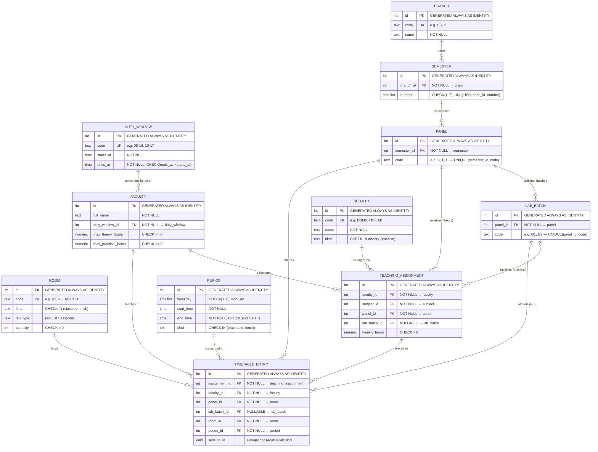

# PanelGrid — Entity-Relationship Diagram

## ER Diagram (Mermaid)

---

## Relationship Summary

| Parent | Child | Cardinality | Meaning |
|--------|-------|-------------|---------|
| `branch` | `semester` | 1 : N | A branch offers multiple semesters |
| `semester` | `panel` | 1 : N | A semester is divided into panels (sections) |
| `panel` | `lab_batch` | 1 : N | Each panel is split into lab batches for practicals |
| `duty_window` | `faculty` | 1 : N | A duty window constrains multiple faculty members |
| `faculty` | `teaching_assignment` | 1 : N | A faculty member has multiple teaching assignments |
| `subject` | `teaching_assignment` | 1 : N | A subject appears in multiple assignments |
| `panel` | `teaching_assignment` | 1 : N | A panel receives multiple theory assignments |
| `lab_batch` | `teaching_assignment` | 0..1 : N | A lab batch receives practical assignments (nullable) |
| `teaching_assignment` | `timetable_entry` | 1 : N | An assignment is placed into multiple time slots |
| `faculty` | `timetable_entry` | 1 : N | Denormalized for the UNIQUE constraint |
| `panel` | `timetable_entry` | 1 : N | Denormalized for the UNIQUE constraint |
| `room` | `timetable_entry` | 1 : N | A room hosts multiple entries across the week |
| `period` | `timetable_entry` | 1 : N | A period contains entries for different panels/rooms |

---

## Integrity Constraints

### Primary Keys
Every table uses `INTEGER GENERATED ALWAYS AS IDENTITY` as its primary key.

### Foreign Keys
| Table | Column | References |
|-------|--------|------------|
| `semester` | `branch_id` | `branch(id)` |
| `panel` | `semester_id` | `semester(id)` |
| `lab_batch` | `panel_id` | `panel(id)` |
| `faculty` | `duty_window_id` | `duty_window(id)` |
| `teaching_assignment` | `faculty_id` | `faculty(id)` |
| `teaching_assignment` | `subject_id` | `subject(id)` |
| `teaching_assignment` | `panel_id` | `panel(id)` |
| `teaching_assignment` | `lab_batch_id` | `lab_batch(id)` — *nullable* |
| `timetable_entry` | `assignment_id` | `teaching_assignment(id)` |
| `timetable_entry` | `faculty_id` | `faculty(id)` |
| `timetable_entry` | `panel_id` | `panel(id)` |
| `timetable_entry` | `lab_batch_id` | `lab_batch(id)` — *nullable* |
| `timetable_entry` | `room_id` | `room(id)` |
| `timetable_entry` | `period_id` | `period(id)` |

### Unique Constraints (Anti-Clash)
| Constraint | Purpose |
|------------|---------|
| `UNIQUE(faculty_id, period_id)` on `timetable_entry` | **No faculty double-booking** — a teacher can only be in one place at a time |
| `UNIQUE(room_id, period_id)` on `timetable_entry` | **No room double-booking** — a room can only host one class at a time |
| Partial unique `(panel_id, period_id) WHERE lab_batch_id IS NULL` | **No theory clash** — a whole panel can't have two theory classes at once |
| Partial unique `(lab_batch_id, period_id) WHERE lab_batch_id IS NOT NULL` | **No lab batch clash** — a lab batch can't be in two labs at once |
| `UNIQUE(weekday, start_time)` on `period` | No duplicate period definitions per day |
| `UNIQUE(branch_id, number)` on `semester` | No duplicate semester numbers per branch |
| `UNIQUE(semester_id, code)` on `panel` | No duplicate panel codes per semester |
| `UNIQUE(panel_id, code)` on `lab_batch` | No duplicate batch codes per panel |

### CHECK Constraints
| Table | Constraint |
|-------|-----------|
| `duty_window` | `ends_at > starts_at` |
| `semester` | `number BETWEEN 1 AND 8` |
| `faculty` | `max_theory_hours >= 0`, `max_practical_hours >= 0` |
| `subject` | `kind IN ('theory', 'practical')` |
| `room` | `kind IN ('classroom', 'lab')`, `capacity > 0`, conditional `lab_type` |
| `teaching_assignment` | `weekly_hours > 0` |
| `period` | `weekday BETWEEN 1 AND 6`, `end_time > start_time`, `kind IN ('teachable', 'lunch')` |

---

## Database Views

| View | Purpose |
|------|---------|
| `v_faculty_load` | Aggregates assigned theory/practical hours per faculty (for workload report) |
| `v_faculty_timetable` | Joins timetable entries with faculty, duty window, subject, panel, room (for faculty report) |
| `v_panel_timetable` | Joins timetable entries with panel, lab batch, subject, faculty, room (for panel/student report) |
| `v_room_occupancy` | Joins timetable entries with room, period, faculty, panel, subject (for room report) |

---

## Normalization

The schema is in **3NF (Third Normal Form)**:

1. **1NF**: All attributes are atomic (no multi-valued or composite attributes).
2. **2NF**: No partial dependencies — every non-key attribute depends on the entire primary key (all PKs are single-column identity).
3. **3NF**: No transitive dependencies — e.g., `duty_window` is factored out of `faculty`; `subject` is factored out of `teaching_assignment`.

The only intentional **denormalization** is `faculty_id`, `panel_id`, and `lab_batch_id` on `timetable_entry` (duplicated from `teaching_assignment`) to enable the UNIQUE anti-clash constraints without requiring joins in the constraint engine.
