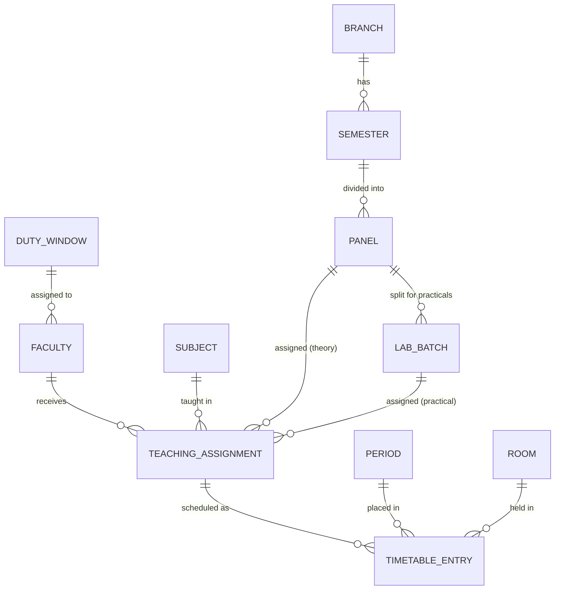

# PanelGrid Timetable Studio - Viva Pack

This document contains the essential artifacts for the DBMS mini-project submission.

## 1. Entity-Relationship (ER) Diagram



## 2. Relational Schema Overview

- **branch(id, code, name)**
- **semester(id, branch_id, number)**
- **panel(id, semester_id, code)**
- **lab_batch(id, panel_id, code)**
- **duty_window(id, code, starts_at, ends_at)**
- **faculty(id, full_name, duty_window_id, max_theory_hours, max_practical_hours, created_at)**
- **subject(id, code, name, kind, created_at)**
- **room(id, code, kind, lab_type, capacity, created_at)**
- **teaching_assignment(id, faculty_id, subject_id, panel_id, lab_batch_id, weekly_hours, created_at)**
- **period(id, weekday, start_time, end_time, kind)**
- **timetable_entry(id, assignment_id, period_id, room_id, created_at)**

## 3. Key SQL Queries (Constraint Engine & Reports)

### A. Detecting Faculty Double-Booking (Overlap)
*Ensures a faculty member is not assigned to two different classes at the same time.*
```sql
SELECT 1 
FROM timetable_entry e 
JOIN teaching_assignment a ON a.id = e.assignment_id 
WHERE a.faculty_id = $1 AND e.period_id = $2
```

### B. Detecting Room Overlap
*Ensures two classes do not occupy the same room at the same time.*
```sql
SELECT 1 
FROM timetable_entry 
WHERE room_id = $1 AND period_id = $2
```

### C. Validating Faculty Duty Window
*Checks if a period falls within the teacher's allowed working hours.*
```sql
SELECT 1 
FROM period p
JOIN faculty f ON f.id = $1
JOIN duty_window w ON w.id = f.duty_window_id
WHERE p.id = $2
  AND p.start_time >= w.starts_at 
  AND p.end_time <= w.ends_at
```

### D. Generating the Panel Timetable View
*Aggregates data across assignments, subjects, and rooms to render the printable Panel Grid.*
```sql
SELECT 
    e.id, 
    p.weekday, 
    p.start_time, 
    p.end_time, 
    p.kind as period_kind,
    s.name as subject, 
    s.kind, 
    f.full_name as faculty, 
    r.code as room,
    pan.code as panel, 
    lb.code as lab_batch
FROM timetable_entry e
JOIN period p ON p.id = e.period_id
JOIN teaching_assignment a ON a.id = e.assignment_id
JOIN subject s ON s.id = a.subject_id
JOIN faculty f ON f.id = a.faculty_id
JOIN room r ON r.id = e.room_id
LEFT JOIN panel pan ON pan.id = a.panel_id
LEFT JOIN lab_batch lb ON lb.id = a.lab_batch_id
```

### E. Weekly Workload Calculation
*Summarizes actual scheduled hours vs defined maximum capacity per faculty.*
```sql
SELECT 
    f.full_name,
    f.max_theory_hours,
    f.max_practical_hours,
    COALESCE(SUM(CASE WHEN s.kind = 'theory' THEN 1 ELSE 0 END), 0) AS scheduled_theory_hours,
    COALESCE(SUM(CASE WHEN s.kind = 'practical' THEN 1 ELSE 0 END), 0) AS scheduled_practical_hours
FROM faculty f
LEFT JOIN teaching_assignment a ON a.faculty_id = f.id
LEFT JOIN timetable_entry e ON e.assignment_id = a.id
LEFT JOIN subject s ON s.id = a.subject_id
GROUP BY f.id
ORDER BY f.full_name;
```
