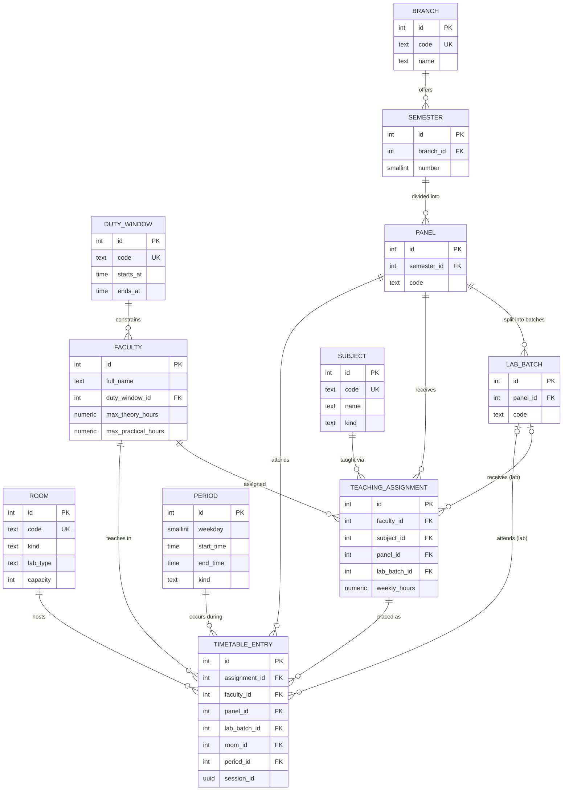

# PanelGrid — DBMS Mini-Project Submission Pack

> **Project**: PanelGrid — Automated Timetable Scheduling System  
> **Team**: Harsh, Darshan  
> **Stack**: Next.js 16 · PostgreSQL (Neon) · Tailwind CSS  
> **Repository**: https://github.com/harsh-codess/DBMS-MINIPROJ-TTSYSTEM

---

## 📁 Submission Contents

| File | Description |
|------|-------------|
| [`docs/er.md`](er.md) | **ER Diagram** — Full Mermaid entity-relationship diagram with all entities, attributes, relationships, constraints, normalization analysis |
| [`docs/sample-queries.sql`](sample-queries.sql) | **12 Sample Queries** — Faculty timetable, panel view, room occupancy, workload analysis, clash detection, utilization stats |
| [`db/schema.sql`](../db/schema.sql) | **Complete Schema** — 10 tables, 4 views, indexes, CHECK/UNIQUE constraints |
| [`db/seed.sql`](../db/seed.sql) | **Seed Data** — Duty windows, branches, semesters, panels, lab batches, faculty, subjects, rooms, periods, assignments |

---

## 1. Entity-Relationship Diagram

> See full diagram with attributes and constraints: [`docs/er.md`](er.md)



---

## 2. Relational Schema

### Table List (10 tables)

| # | Table | Columns | Purpose |
|---|-------|---------|---------|
| 1 | `duty_window` | id, code, starts_at, ends_at | Faculty working hour windows (e.g. 08:00–16:00) |
| 2 | `branch` | id, code, name | Academic branches (CS, IT, etc.) |
| 3 | `semester` | id, branch_id, number | Semester within a branch |
| 4 | `panel` | id, semester_id, code | Class sections (G, F, H) within a semester |
| 5 | `lab_batch` | id, panel_id, code | Lab sub-divisions (G1, G2) within a panel |
| 6 | `faculty` | id, full_name, duty_window_id, max_theory_hours, max_practical_hours | Teaching staff with workload limits |
| 7 | `subject` | id, code, name, kind | Courses — theory or practical |
| 8 | `room` | id, code, kind, lab_type, capacity | Classrooms and labs |
| 9 | `teaching_assignment` | id, faculty_id, subject_id, panel_id, lab_batch_id, weekly_hours | Who teaches what to whom, how many hours/week |
| 10 | `period` | id, weekday, start_time, end_time, kind | Time slots across Mon–Sat |
| 11 | `timetable_entry` | id, assignment_id, faculty_id, panel_id, lab_batch_id, room_id, period_id, session_id | **The generated timetable** — one row per scheduled class |

### Views (4 views)

| View | Purpose |
|------|---------|
| `v_faculty_load` | Aggregates assigned theory + practical hours per faculty |
| `v_faculty_timetable` | Flattened faculty schedule (joins 7 tables) |
| `v_panel_timetable` | Flattened panel/student schedule (joins 7 tables) |
| `v_room_occupancy` | Room usage across the week (joins 6 tables) |

### Indexes

| Index | Type | Purpose |
|-------|------|---------|
| `teaching_assignment_faculty_idx` | B-tree | Fast faculty lookup on assignments |
| `teaching_assignment_panel_idx` | B-tree | Fast panel lookup on assignments |
| `timetable_entry_period_idx` | B-tree | Fast period lookup on entries |
| `timetable_panel_period_uidx` | Partial UNIQUE | Prevent theory double-booking per panel |
| `timetable_batch_period_uidx` | Partial UNIQUE | Prevent lab batch double-booking |

---

## 3. Anti-Clash Constraint Engine

The system prevents scheduling conflicts through **database-level constraints**:

| Clash Type | Enforcement | SQL Mechanism |
|------------|-------------|---------------|
| Faculty double-booking | `UNIQUE(faculty_id, period_id)` | A teacher can only be in one place at a time |
| Room double-booking | `UNIQUE(room_id, period_id)` | A room can only host one class at a time |
| Panel theory clash | Partial unique on `(panel_id, period_id) WHERE lab_batch_id IS NULL` | A panel can't attend two theory classes simultaneously |
| Lab batch clash | Partial unique on `(lab_batch_id, period_id) WHERE lab_batch_id IS NOT NULL` | A lab batch can't be in two labs simultaneously |
| Duty window violation | Application-level check before INSERT | Validates period falls within faculty's allowed hours |

---

## 4. Normalization Analysis

The schema is in **3NF (Third Normal Form)**:

- **1NF** ✅ — All attributes are atomic; no repeating groups or multi-valued fields
- **2NF** ✅ — No partial dependencies (all PKs are single-column identity keys)
- **3NF** ✅ — No transitive dependencies (duty_window factored from faculty; subject factored from assignment)
- **Intentional denormalization**: `faculty_id`, `panel_id`, `lab_batch_id` are duplicated on `timetable_entry` (from `teaching_assignment`) solely to enable the UNIQUE anti-clash constraints without expensive joins

---

## 5. Key Sample Queries

> Full set of 12 queries: [`docs/sample-queries.sql`](sample-queries.sql)

### Faculty Timetable
```sql
SELECT full_name, duty_window, weekday, start_time::text, end_time::text,
       subject, kind, panel, COALESCE(lab_batch, '—'), room
FROM v_faculty_timetable
WHERE full_name = 'Shamala Devi'
ORDER BY weekday, start_time;
```

### Panel Timetable
```sql
SELECT panel, COALESCE(lab_batch, '—'), weekday, start_time::text, end_time::text,
       subject, kind, faculty, room
FROM v_panel_timetable
WHERE panel = 'G'
ORDER BY lab_batch NULLS FIRST, weekday, start_time;
```

### Clash Detection (should return 0 rows)
```sql
SELECT f.full_name, per.weekday, per.start_time::text, COUNT(*)
FROM timetable_entry te
JOIN faculty f ON f.id = te.faculty_id
JOIN period per ON per.id = te.period_id
GROUP BY f.full_name, per.weekday, per.start_time
HAVING COUNT(*) > 1;
```

### Workload vs Placed
```sql
SELECT f.full_name, vl.assigned_theory_hours, vl.assigned_practical_hours,
       COUNT(CASE WHEN s.kind = 'theory' THEN 1 END) AS placed_theory,
       COUNT(CASE WHEN s.kind = 'practical' THEN 1 END) AS placed_practical
FROM faculty f
JOIN v_faculty_load vl ON vl.faculty_id = f.id
LEFT JOIN timetable_entry te ON te.faculty_id = f.id
LEFT JOIN teaching_assignment ta ON ta.id = te.assignment_id
LEFT JOIN subject s ON s.id = ta.subject_id
GROUP BY f.id, f.full_name, vl.assigned_theory_hours, vl.assigned_practical_hours
ORDER BY f.full_name;
```

---

## 6. Application Features

| Feature | Route | Description |
|---------|-------|-------------|
| Dashboard | `/app` | System overview with stats |
| Faculty Management | `/app/faculty` | Add/view faculty members with duty windows |
| Room Management | `/app/rooms` | Manage classrooms and labs |
| Subject Management | `/app/subjects` | Define theory and practical courses |
| Assignments | `/app/assignments` | Create teaching assignments |
| Timetable Generator | `/app/timetable` | Auto-generate conflict-free weekly timetable |
| Panel Report | `/app/reports/panel` | Printable panel timetable (A4 landscape) |
| Faculty Report | `/app/reports/faculty` | Printable faculty timetable (A4 landscape) |
| Room Report | `/app/reports/room` | Printable room occupancy (A4 landscape) |
| Workload Report | `/app/reports/workload` | Faculty workload vs scheduled comparison |
